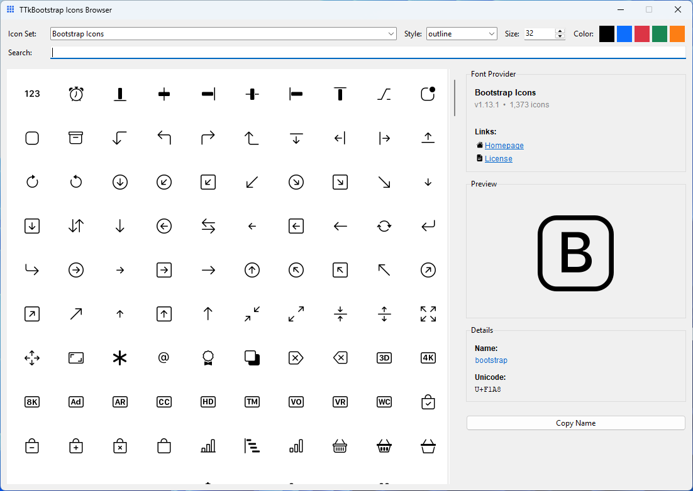
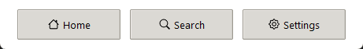

# tkinter-icons

[](https://pypi.org/project/tkinter-icons/)
[](https://pypi.org/project/tkinter-icons/)
[](https://pepy.tech/project/tkinter-icons)
[](LICENSE)

Font-based icons for Tkinter — sixteen icon sets, one import root, no image files to manage.

**[Documentation](https://israel-dryer.github.io/tkinter-icons/)** · **[Icon packs](https://israel-dryer.github.io/tkinter-icons/packs.html)** · **[Getting started](https://israel-dryer.github.io/tkinter-icons/getting-started.html)**

## Install

Icons come from packs, installed as extras:

```bash
pip install "tkinter-icons[material]"
```

```python
import tkinter as tk
from tkinter import ttk

from tkinter_icons import MaterialIcon

root = tk.Tk()

home = MaterialIcon("home", size=24, color="#0d6efd")
ttk.Button(root, text="Home", image=home.image, compound="left").pack(padx=20, pady=20)

root.mainloop()
```

The quotes matter — most shells treat unquoted brackets as a glob, and zsh fails outright without them. Need two sets? `"tkinter-icons[material,simple]"`.

> **The base package draws nothing on its own.** It is the renderer; the glyphs live in the packs. That is why every install line here carries an extra.

## Is this for you?

**Yes** if you are writing plain `tkinter`/`ttk`, or you want an icon set other than Bootstrap.

**Maybe not** if you use [ttkbootstrap](https://github.com/israel-dryer/ttkbootstrap) or [bootstack](https://github.com/israel-dryer/bootstack) *and* Bootstrap icons are all you need — both have those built in. This library is still useful with either when you want a different set.

## Icon browser

Icon names are hard to guess, so the base package ships a browser. Search every installed set, preview at the size and color you will actually use, and copy the name.

```bash
tkinter-icons
```



## The packs

Each pack is its own distribution because each ships a font, but you install them as extras and import from `tkinter_icons`. Counts and styles are on the [packs page](https://israel-dryer.github.io/tkinter-icons/packs.html); each pack's changelog lives beside its source.

| Extra | Distribution | Icon set |
|---|---|---|
| `bootstrap` | [tkinter-icons-bs](https://pypi.org/project/tkinter-icons-bs/) | Bootstrap Icons |
| `devicon` | [tkinter-icons-devicon](https://pypi.org/project/tkinter-icons-devicon/) | Devicon |
| `eva` | [tkinter-icons-eva](https://pypi.org/project/tkinter-icons-eva/) | Eva Icons |
| `fluent` | [tkinter-icons-fluent](https://pypi.org/project/tkinter-icons-fluent/) | Fluent System Icons |
| `fluent-regular` | [tkinter-icons-fluent-reg](https://pypi.org/project/tkinter-icons-fluent-reg/) | Fluent System Icons (Regular) |
| `fontawesome` | [tkinter-icons-fa](https://pypi.org/project/tkinter-icons-fa/) | Font Awesome 6 (Free) |
| `google-material` | [tkinter-icons-gmi](https://pypi.org/project/tkinter-icons-gmi/) | Google Material Icons |
| `ionicons` | [tkinter-icons-ion](https://pypi.org/project/tkinter-icons-ion/) | Ion Icons |
| `lucide` | [tkinter-icons-lucide](https://pypi.org/project/tkinter-icons-lucide/) | Lucide Icons |
| `material` | [tkinter-icons-mat](https://pypi.org/project/tkinter-icons-mat/) | Material Design Icons |
| `meteocons` | [tkinter-icons-meteocons](https://pypi.org/project/tkinter-icons-meteocons/) | Meteocons |
| `remix` | [tkinter-icons-remix](https://pypi.org/project/tkinter-icons-remix/) | Remix Icon |
| `rpg-awesome` | [tkinter-icons-rpga](https://pypi.org/project/tkinter-icons-rpga/) | RPG Awesome |
| `simple` | [tkinter-icons-simple](https://pypi.org/project/tkinter-icons-simple/) | Simple Icons |
| `typicons` | [tkinter-icons-typicons](https://pypi.org/project/tkinter-icons-typicons/) | Typicons |
| `weather` | [tkinter-icons-weather](https://pypi.org/project/tkinter-icons-weather/) | Weather Icons |

There is deliberately no `[all]` extra. The sets serve disjoint purposes — brand marks, developer logos, fantasy glyphs, weather symbols — so no application draws from all of them, and installing every one costs roughly 17 MB to supply fifteen sets nobody opens.

## Stateful icons

An icon mapped onto a widget follows that widget's own per-state colors, and re-renders when the theme changes:

```python
icon = BootstrapIcon("house", size=16)
button = ttk.Button(app, text="Home", bootstyle="success")
icon.map(button)
```



Per-state colors and per-state icon names are covered in [the guide](https://israel-dryer.github.io/tkinter-icons/guide/stateful-icons.html).

## Upgrading from ttkbootstrap-icons

This project was `ttkbootstrap-icons` through 4.0.0, and was renamed in 5.0.0 because the old name described a relationship that no longer exists — Bootstrap icons are now built directly into ttkbootstrap and bootstack.

Existing code keeps working: `ttkbootstrap-icons` 5.0.0 is a forwarding shim that re-exports everything, submodules included. See [the migration notes](https://israel-dryer.github.io/tkinter-icons/getting-started.html#migrating).

## Contributing

The repository holds eighteen distributions — the base package, sixteen packs, and the shim. [The contributing guide](https://israel-dryer.github.io/tkinter-icons/contributing.html) covers the layout, the developer API, and how a pack is built. Issues and pull requests welcome.

## License

MIT for everything in this repository. The icons are not ours: each pack redistributes an upstream font under that project's own license and ships the text inside the package. See [THIRD-PARTY-NOTICES.md](THIRD-PARTY-NOTICES.md), and [the license page](https://israel-dryer.github.io/tkinter-icons/license.html) for the few sets with attribution terms.
