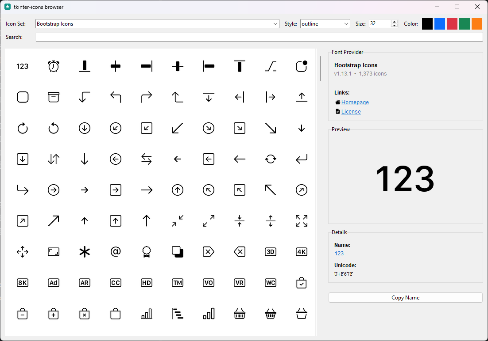

<picture>
  <source media="(prefers-color-scheme: dark)"
          srcset="https://raw.githubusercontent.com/israel-dryer/tkinter-icons/main/assets/png/wordmark-dark.png">
  
</picture>

[](https://github.com/israel-dryer/tkinter-icons/actions/workflows/ci.yml)
[](https://pypi.org/project/tkinter-icons/)
[](https://pypi.org/project/tkinter-icons/)
[](LICENSE)

Font-based icons for Tkinter — 61,000+ icons across sixteen sets, one import, no image files to manage.

**[Documentation](https://tkinter-icons.readthedocs.io/en/latest/)** · **[Icon packs](https://tkinter-icons.readthedocs.io/en/latest/packs.html)** · **[Get started](https://tkinter-icons.readthedocs.io/en/latest/getting-started/installation.html)**

## Install

One line puts a full icon set in your project:

```bash
pip install "tkinter-icons[material]"
```

Copy this and run it:

```python
import tkinter as tk
from tkinter import ttk

from tkinter_icons import MaterialIcon

root = tk.Tk()

home = MaterialIcon("home", size=24, color="#0F766E")
ttk.Button(root, text="Home", image=home.image, compound="left").pack(padx=20, pady=20)

root.mainloop()
```

Name two sets together as `"tkinter-icons[material,simple]"`. The quotes matter — most shells treat unquoted brackets as a glob, and zsh fails outright without them.

## What you get

- **Sixteen sets, one API.** Material, Font Awesome, Lucide, Bootstrap, Simple Icons, weather symbols, developer logos, fantasy glyphs. Every pack's class takes the same `(name, size, color, style)`, so switching sets is a one-line change.
- **Sharp at any size.** Glyphs are centered on their measured ink rather than the font's own bounding box, which under-reports it. Odd sizes snap even; small sizes oversample and downscale with a light sharpen.
- **No image assets to manage.** Size and color are arguments, not files. No `icons/` directory, no `@2x` duplicates, no second set for dark mode.
- **Follows your ttk theme.** An icon mapped onto a widget takes that widget's own per-state colors, and re-renders when the theme changes.

```python
icon = BootstrapIcon("house", size=16)
button = ttk.Button(root, text="Home")
button.pack()

icon.map(button)
```


Per-state colors and per-state icon names are covered in [the guide](https://tkinter-icons.readthedocs.io/en/latest/user-guide/stateful-icons.html).

## Find the name you need

Icon names are the upstream project's own and hard to guess — Material Design Icons calls the gear `cog`. The base package ships a browser: search every installed set, preview at the size and color you will actually use, and copy the name.

```bash
tkinter-icons
```



## The packs

Each pack is its own distribution because each ships a font, but you install them as extras and import from `tkinter_icons` — the distribution names never come up. Counts, styles, and a preview of every set are on the [packs page](https://tkinter-icons.readthedocs.io/en/latest/packs.html).

| Extra | Icon set | | Extra | Icon set |
|---|---|---|---|---|
| `bootstrap` | Bootstrap Icons | | `lucide` | Lucide Icons |
| `devicon` | Devicon | | `material` | Material Design Icons |
| `eva` | Eva Icons | | `meteocons` | Meteocons |
| `fluent` | Fluent System Icons | | `remix` | Remix Icon |
| `fluent-regular` | Fluent System Icons (Regular) | | `rpg-awesome` | RPG Awesome |
| `fontawesome` | Font Awesome 6 (Free) | | `simple` | Simple Icons |
| `google-material` | Google Material Icons | | `typicons` | Typicons |
| `ionicons` | Ion Icons | | `weather` | Weather Icons |

## Upgrading from ttkbootstrap-icons

This project was `ttkbootstrap-icons` through 4.0.0, and was renamed in 5.0.0 because the old name described a relationship that no longer exists — Bootstrap icons are now built directly into ttkbootstrap.

Existing code keeps working: `ttkbootstrap-icons` 5.0.0 is a forwarding shim that re-exports everything, submodules included. See [the migration notes](https://tkinter-icons.readthedocs.io/en/latest/getting-started/migrating.html).

## Contributing

The repository holds eighteen distributions — the base package, sixteen packs, and the shim. [The contributing guide](https://tkinter-icons.readthedocs.io/en/latest/about/contributing.html) covers the layout, the developer API, and how a pack is built. Issues and pull requests welcome.

## License

MIT for everything in this repository. The icons are not ours: each pack redistributes an upstream font under that project's own license and ships the text inside the package. See [THIRD-PARTY-NOTICES.md](THIRD-PARTY-NOTICES.md), and [the license page](https://tkinter-icons.readthedocs.io/en/latest/about/license.html) for the few sets with attribution terms.
