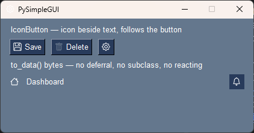

PySimpleGUI
===========

`PySimpleGUI <https://github.com/PySimpleGUI/PySimpleGUI>`_ builds a window from a layout you write as a list of lists. Because the layout is written before any window exists, there is nothing to attach an icon to at the point you write it — so icons arrive two ways:

.. grid:: 1 2 2 2
   :gutter: 3

   .. grid-item-card:: :class:`~tkinter_icons.extensions.psg.IconButton`

      For an icon **beside text**, or one that should react to hover, press and disable.

   .. grid-item-card:: :meth:`Icon.to_data <tkinter_icons.Icon.to_data>`

      For anything that takes an image: ``sg.Image``, ``sg.Tab``, the window icon, icon-only buttons.

   The top row is :class:`~tkinter_icons.extensions.psg.IconButton`, with Delete shown disabled. The bottom row is ``to_data()`` bytes on an ``sg.Image`` and an icon-only ``sg.Button``.

Installing
----------

PySimpleGUI is not a dependency of ``tkinter-icons`` and nothing from it is bundled here. Install it yourself:

.. code-block:: shell

   pip install "tkinter-icons[bootstrap]" PySimpleGUI

Buttons
-------

.. code-block:: python

   import PySimpleGUI as sg

   from tkinter_icons import BootstrapIcon
   from tkinter_icons.extensions.psg import IconButton

   layout = [
       [IconButton("Save", icon=BootstrapIcon("floppy", 16), key="-SAVE-")],
       [IconButton("", icon=BootstrapIcon("gear", 16), compound="none", key="-PREFS-")],
   ]

   window = sg.Window("Editor", layout, finalize=True)

Give the icon the pixel size you want it drawn at. **Leave the color alone and it takes the button's**, so icons match your theme without being told to — which is why there is no color above. Give the icon a color and that color is kept, while hover, press and disable still follow the button.

The icon is applied when the window is built, before it is shown.

Reacting to the button
----------------------

By default the icon follows the button's own colors, so it greys out along with the label when the button is disabled. Pass ``reactive_states`` to say more:

.. code-block:: python

   IconButton(
       "Delete",
       icon=BootstrapIcon("trash", 16),
       reactive_states={
           "hover": "#f0918d",
           "pressed": "#d9534f",
           "disabled": {"name": "trash-fill", "color": "#7c8a99"},
       },
       key="-DELETE-",
       use_ttk_buttons=True,
   )

Each state takes a color, or a dict that can swap the glyph too — above, the disabled state changes to the filled trash. ``reactive_states=False`` is the opposite: it draws the icon in the color you built it with and ignores the button entirely.

The three states are ``hover``, ``pressed`` and ``disabled``. **Hover needs** ``use_ttk_buttons=True``: a plain ``tk`` button cannot carry a separate hover image, and asking for one there warns and is ignored. PySimpleGUI defaults to ``tk`` buttons on Windows and Linux.

Changing the icon later
-----------------------

``update()`` takes what the constructor takes, so one button can carry two glyphs:

.. code-block:: python

   window["-PLAY-"].update(icon=BootstrapIcon("pause-fill", 16))

``compound`` and ``reactive_states`` can be updated the same way. The ordinary PySimpleGUI arguments work as they always did, and the icon keeps up with two of them by itself: ``update(disabled=True)`` switches to the disabled glyph, and ``update(button_color=...)`` re-tints the icon to match.

Everything that is not a button
-------------------------------

Elsewhere PySimpleGUI wants image **bytes**. Build the icon the same way and ask for its data — but here there is no button to take a color from, so give it one:

.. code-block:: python

   white = "#FFFFFF"

   layout = [
       [sg.Image(data=BootstrapIcon("house", 16, white).to_data()), sg.Text("Dashboard")],
       [sg.Button(image_data=BootstrapIcon("bell", 16, white).to_data(), key="-BELL-")],
       [sg.TabGroup([[
           sg.Tab("Home", [[sg.Text("...")]],
                  image_source=BootstrapIcon("house", 16, white).to_data()),
       ]])],
   ]

   window = sg.Window(
       "Dashboard", layout, finalize=True,
       icon=BootstrapIcon("gear", 32, white).to_data(),
   )

The same bytes work at runtime — ``window["-IMG-"].update(data=...)``.

.. tip::

   :meth:`Icon.render_data <tkinter_icons.Icon.render_data>` does the same without an instance: ``BootstrapIcon.render_data("house", 16, white)``.

Caveats
-------

**Set** ``compound="none"`` **on a button with no text.** The default, ``"left"``, reserves room for a label that is not there — on a ttk button that is around 70 px of empty space.

**Do not use** ``image_data`` **on a Button as a substitute for** :class:`~tkinter_icons.extensions.psg.IconButton`. PySimpleGUI centers the image and sizes the button to it, so any text is drawn *on top of* the icon. Use it for icon-only buttons; use ``IconButton`` when there is a label. Bytes also never react to state or color — that is the difference between the two.

**An explicit** ``size=`` **is not honored on a tk icon button.** Tk measures a button in characters while it shows text alone and in pixels once it also shows an image, so the button is auto-sized instead. ``ttk`` buttons are unaffected.

**A tab icon does not react to selection.** ``sg.Tab(image_source=...)`` sets a fixed per-tab image, and ttk's style map does not override it. If you want the current tab marked, swap the image yourself on the tab-changed event — ``window["-TABS-"].Widget.tab(index, image=...)``, keeping a reference to each ``tk.PhotoImage``.

**A theme set with** ``sg.theme()`` **does not change a window that already exists**, in PySimpleGUI or here. Build the window after setting the theme, and its icons will be colored to match.

.. versionadded:: 5.1.0
   ``tkinter_icons.extensions.psg``.
