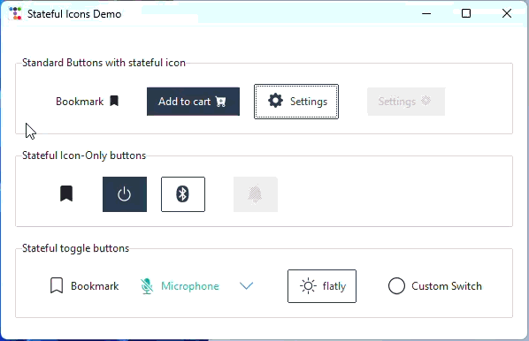
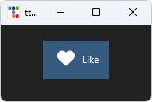
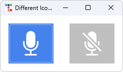

# Stateful Icons


Stateful Icons allow you to create dynamic, interactive icons that automatically change their appearance based on widget
states like hover, pressed, disabled, and more. This powerful feature brings modern UI/UX patterns to your tkinter
applications with minimal code.



---

## What is State Mapping?

State mapping connects different icon appearances to specific widget states. When a user interacts with a widget (
hovering over a button, clicking it, etc.), the icon automatically updates to reflect that interaction.

**Common use cases:**

- Change icon color on hover to provide visual feedback
- Display a different icon variant when a button is pressed
- Show a dimmed/greyed icon when a widget is disabled
- Highlight active navigation items with distinct icons

---

## How It Works

The `StatefulIconMixin` is included with all icon classes in ttkbootstrap-icons. It works by:

1. **Reading widget states**: Detects ttk widget states like `hover`, `pressed`, `disabled`, `selected`, etc.
2. **Mapping states to icons**: Associates each state with an icon appearance (color and/or name)
3. **Automatic rendering**: Generates icon images for each state
4. **Style application**: Creates a child ttk style with state-aware image mappings

The mixin works with **any ttk widget that accepts an `image` parameter**, including:

- `ttk.Button`
- `ttk.Checkbutton`
- `ttk.Radiobutton`
- `ttk.Label`
- `ttk.Menubutton`
- And more...

---

## Basic Usage

### Automatic Color Mapping

The simplest approach: icons automatically inherit the parent style's foreground colors for each state.

```python
import ttkbootstrap as tb
from ttkbootstrap_icons import BootstrapIcon

root = tb.Window(themename="darkly")

# Create an icon
icon = BootstrapIcon("heart", size=32)

# Create a button
btn = tb.Button(root, text="Like", compound="left")

# Map the icon to the button - colors auto-match the theme
icon.map(btn)

btn.pack(padx=20, pady=20)
root.mainloop()
```



In this example, the icon will:

- Use the button's normal foreground color by default
- Change to the hover foreground color when you hover over the button
- Use the pressed color when clicked
- Appear dimmed when disabled

---

## Custom State Specifications

### Override Colors Per State

You can explicitly set icon colors for specific states:

```python
from ttkbootstrap_icons import BootstrapIcon

icon = BootstrapIcon("star", size=24)

# Define custom colors for each state
icon.map(
    button,
    statespec=[
        ("disabled", "gray"),
        ("pressed !disabled", "red"),
        ("hover !disabled", "gold")
    ]
)
```


### Change Icon Name Per State

Display entirely different icons for different states:

```python
from ttkbootstrap_icons import BootstrapIcon

sound = BootstrapIcon("mic-mute-fill", 64)

# Switch to muted mic icon on selected
sound.map(toggle, statespec=[("selected", {"name": "mic-fill"})])
```



This is perfect for creating toggle-like visual feedback or showing action previews.

---

## Merge vs Replace Modes

By default, the `map()` method uses **merge mode**, which preserves existing state mappings and adds new ones. You can
change this behavior:

### Merge Mode (Default)

```python
icon.map(button, statespec=[("hover", "#ff0000")])
# Later, add more states
icon.map(button, statespec=[("pressed", "#aa0000")], mode="merge")
# Both hover and pressed states are now active
```

### Replace Mode

```python
icon.map(button, statespec=[("hover", "#ff0000")])
# Replace all previous mappings
icon.map(button, statespec=[("pressed", "#aa0000")], mode="replace")
# Only pressed state is active now
```

---

## Custom Child Style Names

By default, child styles are auto-named based on the icons used. You can provide a custom name for better control:

```python
icon.map(
    button,
    subclass="MyCustomButton",  # Creates "MyCustomButton.TButton" style
    statespec=[("hover", "#007bff")]
)
```

This is useful when:

- You want predictable style names for debugging
- You're applying the same state mapping to multiple widgets
- You need to reference the style elsewhere in your code

---

## Working with Different Icon Providers

Stateful icons work with **all** icon providers:

```python
# Font Awesome
from ttkbootstrap_icons_fa import FAIcon

icon = FAIcon("heart", size=24, style="solid")
icon.map(button, statespec=[("hover", "#e74c3c")])

# Remix Icons
from ttkbootstrap_icons_remix import RemixIcon

icon = RemixIcon("star-line", size=24)
icon.map(button, statespec=[("hover", {"name": "star-fill"})])

# Material Icons
from ttkbootstrap_icons_mat import MatIcon

icon = MatIcon("favorite", size=24, style="outlined")
icon.map(button, statespec=[("hover", {"name": "favorite", "color": "#f44336"})])

# Bootstrap Icons (built-in)
from ttkbootstrap_icons import Icon

icon = Icon("heart", size=24)
icon.map(button, statespec=[("hover", "#dc3545")])
```

---

## Tips and Best Practices

### 1. Use Theme Colors

Let icons inherit theme colors for consistent appearance:

```python
# Automatic theme color inheritance
icon.map(button)  # No statespec needed!
```

### 2. Test All States

Always test your stateful icons in all applicable states:

* Normal
* Hover
* Pressed/Active
* Disabled
* Selected (for checkbuttons/radiobuttons)

### 3. Provide Visual Feedback

Use stateful icons to give users immediate feedback:

* Color change on hover = clickable
* Icon swap on press = action preview
* Dimmed icon on disable = unavailable

### 4. Keep It Subtle

Overly dramatic state changes can be distracting. Aim for smooth, professional transitions:

* ✅ Slight color darkening on hover
* ✅ Icon variant swap (outline to filled)
* ❌ Completely different unrelated icons
* ❌ Jarring color shifts (red to yellow to green)

### 5. Consider Accessibility

Ensure adequate color contrast in all states:

```python
# Good: Clear contrast in all states
statespec = [
    ("hover", "#0056b3"),  # Dark blue
    ("!hover", "#007bff"),  # Medium blue
    ("disabled", "#6c757d"),  # Grey
]
```

---

## Common State Flags

TTK widgets support various state flags that you can use in your `statespec`:

| State Flag | Description                   | Common Widgets           |
|:-----------|:------------------------------|:-------------------------|
| `hover`    | Mouse is over the widget      | All interactive widgets  |
| `pressed`  | Widget is being clicked       | Button, Checkbutton      |
| `selected` | Widget is in selected state   | Checkbutton, Radiobutton |
| `disabled` | Widget is disabled            | All widgets              |
| `active`   | Widget has focus or is active | All widgets              |
| `focus`    | Widget has keyboard focus     | All widgets              |
| `!state`   | Negation (NOT in this state)  | All (e.g., `!disabled`)  |

You can combine states using spaces:

```python
("hover !disabled", "#007bff")  # Hover AND not disabled
("selected active", "#28a745")  # Selected AND active
```

---

## Troubleshooting

### Icons Not Changing on State

- **Check widget type**: Ensure the widget supports the states you're using
- **Verify state syntax**: Use correct state flag names (case-sensitive)
- **Test mode**: Try `mode="replace"` to clear previous mappings

### Colors Not Applying

- **Color format**: Use hex colors (`#RRGGBB`) or named colors (`"red"`)
- **Theme override**: Some themes may override certain state colors
- **Check specificity**: More specific state combinations match first

### Performance with Many Icons

- **Reuse instances**: Don't create new icon instances unnecessarily
- **Use subclass names**: Helps ttk cache and reuse styles efficiently
- **Limit states**: Only map states you actually need

### StyleBuilderTTK Errors

- **subclass**: When using this library with ttkbootstrap, the styling engine will sometimes confuse the automatic
  subclass. If you run into this issue, just manually create a subclass using the `subclass` parameter to avoid issues
  with StyleBuilderTTK.

---

## Next Steps

- **API Reference**: See the [StatefulIconMixin API documentation](api/core/stateful_icon_mixin.md) for complete method
  signatures and parameters
- **Icon Browser**: Use the [Icon Browser](icon-browser.md) to explore available icons and styles
- **Provider Docs**: Check provider-specific documentation for style variants available for state mapping
