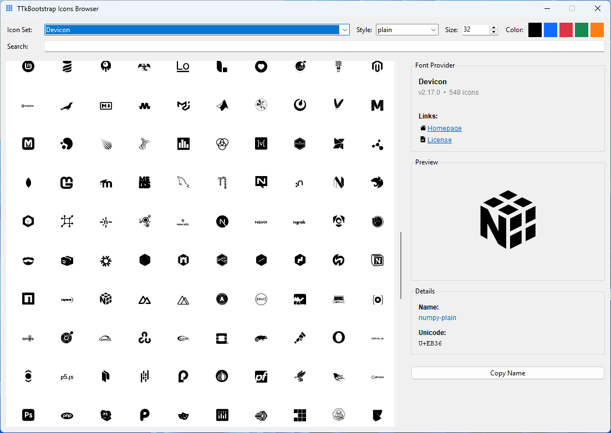

# ttkbootstrap-icons-devicon

An icon provider for the `ttkbootstrap-icons` library.  
Devicon provides brand and technology icons for programming languages and development tools.

[](https://pypi.org/project/ttkbootstrap-icons-devicon/)
[](#license-and-attribution)

---

## Install

```bash
pip install ttkbootstrap-icons-devicon
```

---

## Quick start

```python
import tkinter as tk
from ttkbootstrap_icons_devicon import DevIcon

root = tk.Tk()

py = DevIcon("python-plain", size=24, color="#3776AB")
js = DevIcon("javascript-original-wordmark", size=20)

tk.Button(root, image=py.image, text="Python", compound="left").pack()
tk.Button(root, image=js.image, text="JavaScript", compound="left").pack()

root.mainloop()
```

---

## Styles

| Variant             | Description                  |
|:--------------------|:-----------------------------|
| `original`          | colored base icons           |
| `original-wordmark` | includes brand wordmark      |
| `plain`             | monochrome (outline) variant |
| `plain-wordmark`    | monochrome with brand name   |

---

## Icon Browser

Browse available icons with the built-in browser. From your terminal run:

```bash
ttkbootstrap-icons
```

Use **Copy Name** in the browser to copy the icon name and style directly for use in your code.



---

## License and Attribution

- Upstream license: MIT (Devicon) - https://devicon.dev
- Wrapper license: MIT (c) Israel Dryer
