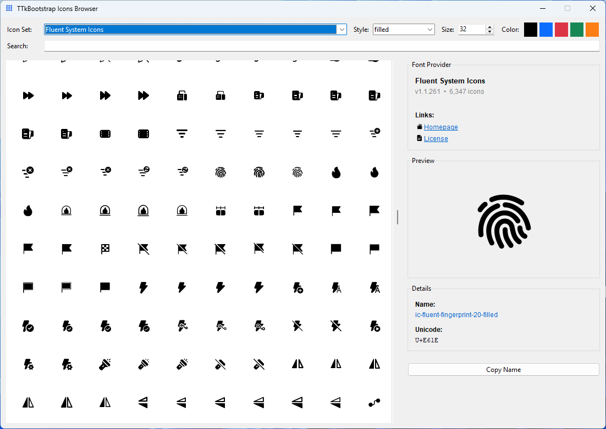

# ttkbootstrap-icons-fluent

An icon provider for the `ttkbootstrap-icons` library.  
Fluent System Icons by Microsoft provide regular and filled styles across many sizes.

[](https://pypi.org/project/ttkbootstrap-icons-fluent/)
[](#license-and-attribution)

---

## Install

```bash
pip install ttkbootstrap-icons-fluent
```

---

## Quick start

```python
import tkinter as tk
from ttkbootstrap_icons_fluent import FluentIcon

root = tk.Tk()

regular = FluentIcon("home-16", size=24, color="#6f42c1", style="regular")
filled = FluentIcon("home-16", size=24, color="#6f42c1", style="filled")

tk.Button(root, image=regular.image, text="Regular", compound="left").pack()
tk.Button(root, image=filled.image, text="Filled", compound="left").pack()

root.mainloop()
```

---

## Styles

| Variant   | Description          |
|:----------|:---------------------|
| `regular` | Outline/line style   |
| `filled`  | Filled style         |

---

## Icon Browser

Browse available icons with the built-in browser. From your terminal run:

```bash
ttkbootstrap-icons
```

Use **Copy Name** in the browser to copy the icon name and style directly for use in your code.



---

## License and Attribution

- **Upstream license:** Microsoft Fluent UI System Icons — https://github.com/microsoft/fluentui-system-icons
- **Wrapper license:** MIT © Israel Dryer

