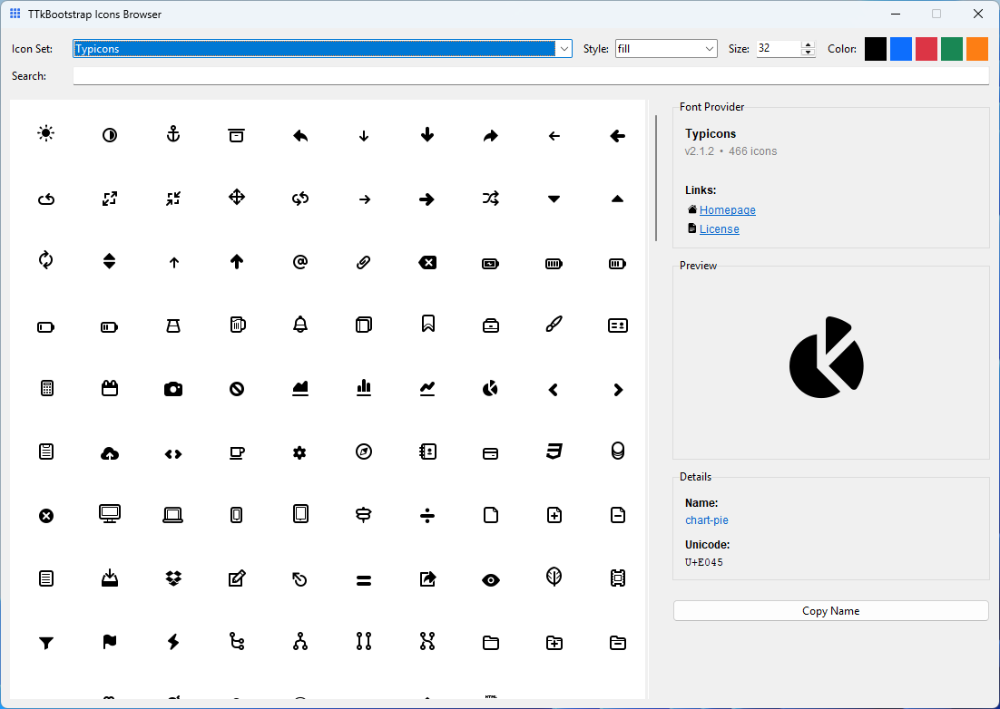

# ttkbootstrap-icons-typicons

An icon provider for the `ttkbootstrap-icons` library.  
Typicons is a versatile pictographic font with filled and outline styles.

[](https://pypi.org/project/ttkbootstrap-icons-typicons/)
[](#license-and-attribution)

---

## Install

```bash
pip install ttkbootstrap-icons-typicons
```

---

## Quick start

```python
import tkinter as tk
from ttkbootstrap_icons_typicons import TypiconsIcon

root = tk.Tk()

fill_ic = TypiconsIcon("arrow-down", size=64, color="#333", style="fill")
outline_ic = TypiconsIcon("arrow-down", size=64, color="#333", style="outline")

tk.Label(root, text="Fill", image=fill_ic.image, compound="left").pack()
tk.Label(root, text="Outline", image=outline_ic.image, compound="left").pack()

root.mainloop()
```

---

## Styles

| Variant   | Description            |
|:----------|:-----------------------|
| `fill`    | Filled glyphs          |
| `outline` | Outline/stroked glyphs |

---

## Icon Browser

Browse available icons with the built-in browser. From your terminal run:

```bash
ttkbootstrap-icons
```

Use "Copy Name" in the browser to copy the icon name and style directly for use in your code.



---

## License and Attribution

- Upstream: Typicons — https://www.s-ings.com/typicons/
- Wrapper license: MIT © Israel Dryer
