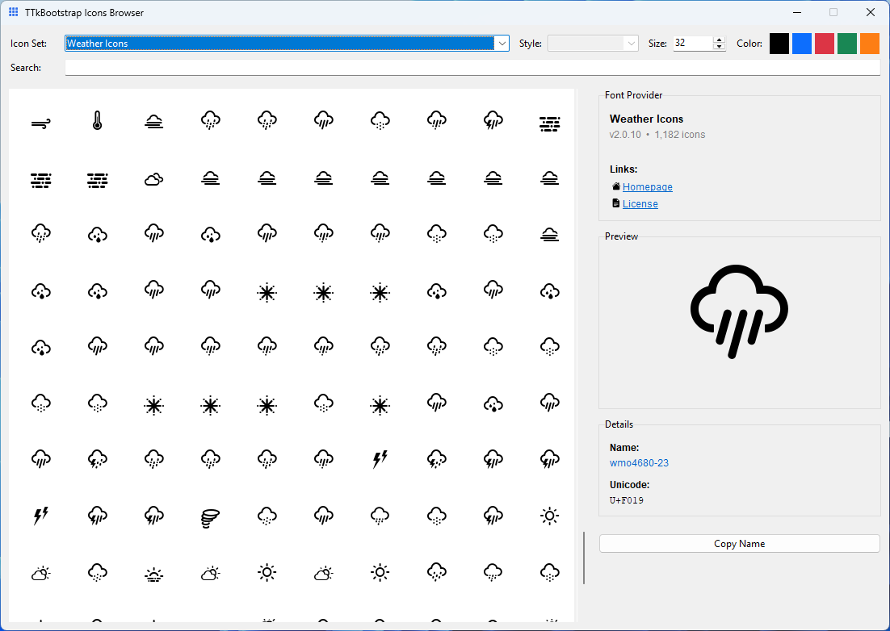

# ttkbootstrap-icons-weather

An icon provider for the `ttkbootstrap-icons` library.  
Weather Icons is a classic set of weather-related glyphs.

[](https://pypi.org/project/ttkbootstrap-icons-weather/)
[](#license-and-attribution)

---

## Install

```bash
pip install ttkbootstrap-icons-weather
```

---

## Quick start

```python
import tkinter as tk
from ttkbootstrap_icons_weather import WeatherIcon

root = tk.Tk()

icon = WeatherIcon("day-sunny", size=24, color="#ffbf00")
tk.Button(root, image=icon.image).pack()

root.mainloop()
```

---

## Styles

This provider uses a single font without separate style variants.

---

## Icon Browser

Browse available icons with the built-in browser. From your terminal run:

```bash
ttkbootstrap-icons
```

Use **Copy Name** in the browser to copy the icon name and style directly for use in your code.



---

## License and Attribution

- **Upstream license:** Weather Icons - https://erikflowers.github.io/weather-icons/
- **Wrapper license:** MIT - Israel Dryer
